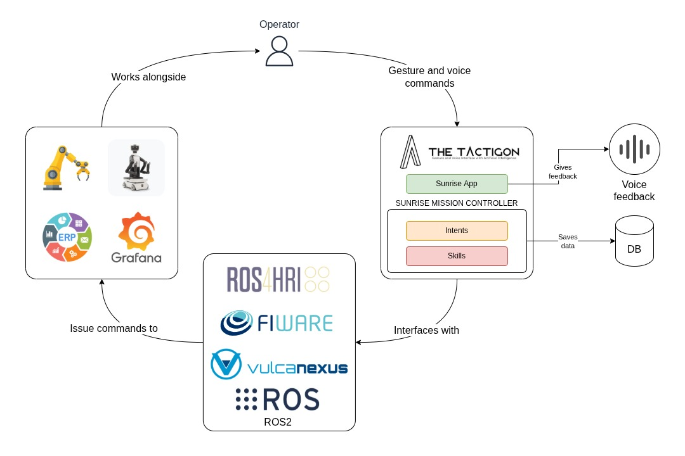

# Sunrise — Multimodal HRI Middleware

**Company:** Next Industries s.r.l.  
**Authors:** Massimiliano Bellino - Stefano Barbareschi  
**License:** Apache 2.0  
**ARISE Project:** [arise-middleware.eu](https://arise-middleware.eu/)  
**Release version:** sunrise `0.0.1` · sunrise_msgs `0.0.1` · tactigon-gear `5.5.2`

---

## Table of Contents

1. [What This Module Does](#1-what-this-module-does)
2. [ARISE Connection](#2-arise-connection)
3. [Target Robotic Platforms](#3-target-robotic-platforms)
4. [Robot Missions](#4-robot-missions)
5. [Robot Tasks](#5-robot-tasks)
6. [Off-the-Shelf Capabilities](#6-off-the-shelf-capabilities)
7. [Architecture and Components](#7-architecture-and-components)
8. [ROS 2 / Vulcanexus Interfaces](#8-ros-2--vulcanexus-interfaces)
9. [FIWARE Interfaces](#9-fiware-interfaces)
10. [DDS NGSI-LD Integration](#10-dds-ngsi-ld-integration)
11. [ROS4HRI Alignment](#11-ros4hri-alignment)
12. [Installation](#12-installation)
13. [Software Dependencies](#13-software-dependencies)
14. [Hardware Dependencies](#14-hardware-dependencies)
15. [Simulation / Mock Path (Hardware-Free)](#15-simulation--mock-path-hardware-free)
16. [Hello World](#16-hello-world)
17. [Basic Demo](#17-basic-demo)
18. [Role in the TRL 6-7 Demonstrator](#18-role-in-the-trl-6-7-demonstrator)
19. [Known Limitations](#19-known-limitations)
20. [Ad-Hoc, Proprietary, and Future Work](#20-ad-hoc-proprietary-and-future-work)
21. [Maintainer / Contact](#21-maintainer--contact)
22. [Change Log](#22-change-log)

---

## 1. What This Module Does

**Sunrise** is a **middleware for multimodal human-robot interaction (HRI)** that enables industrial operators to teach and replay robot skills using natural, gesture- and voice-based interfaces — without dedicated programming knowledge.

**Problem:** Programming industrial robots traditionally requires expert-level knowledge of robot-specific languages and tooling. This creates a barrier when non-expert operators need to adapt robot behavior on the shop floor.

**Solution:** Sunrise provides a software layer that:

- Receives **multimodal operator inputs** — hand gestures (Tactigon-Skin wearable IMU), capacitive touch, voice commands, and ArUco marker pointing — and normalizes them into structured ROS 2 messages.
- Routes normalized inputs through a **Mission Controller** (`TEO` for teaching, `LEO` for replay) that manages a `IDLE → TEACH → REPEAT` state machine.
- Dispatches **robot commands** to the appropriate backend driver (Arduino Braccio over Bluetooth, COMAU Racer 7 over Ethernet).
- Streams all telemetry and interaction events to **FIWARE Orion-LD** for real-time monitoring in Grafana.

A third party can understand and replicate this module — without the original industrial hardware — using the bundled `sunrise_tactigon_mock` GUI that emulates all wearable inputs.

---

## 2. ARISE Connection

Sunrise is an FSTP experiment within the **ARISE** (Agile, human-centric, and Real-time enabled Open Source technologies) program.

| ARISE Concept | Sunrise Implementation |
|---|---|
| **ARISE Middleware** | Sunrise acts as the HRI layer sitting between human operators and industrial robots |
| **ROS 2 / Vulcanexus** | All nodes built on eProsima Vulcanexus (Fast-DDS); cross-version bridging between Jazzy (main) and Humble (COMAU driver) |
| **FIWARE NGSI-LD** | All interaction events and telemetry forwarded to Orion-LD via eProsima Integration Service |
| **DDS Enabler** | `config/orion-dds.json` configures the eProsima DDS Enabler for direct topic-to-entity mapping |
| **ROS4HRI** | Human-related topics follow REP-155 namespace convention (`/human/body/...`, `/human/voices/...`) |

ARISE experiment page: [https://arise-middleware.eu/](https://arise-middleware.eu/) — the experiment-specific listing will be added once the FSTP project page is published on the ARISE ecosystem website.

---

## 3. Target Robotic Platforms

| Platform | Type | Interface |
|---|---|---|
| **COMAU Racer 7-1.4** | 6-DoF collaborative industrial arm | ROS 2 Action (`ExecuteJointTrajectory`) over Ethernet |
| **Arduino Braccio** | 5-DoF desktop robotic arm | Bluetooth LE via `tactigon_arduino_braccio` |

The middleware is robot-agnostic at the command level. Any robot backend that implements the `BraccioCommand` / `BraccioJointCommand` subscriber pattern can be integrated by registering a new entry in `config/mission_controller_student.json`.

---

## 4. Robot Missions

| Mission | Description |
|---|---|
| **Teach-and-Repeat** | An operator demonstrates a skill by physically guiding the robot (or commanding it through the wearable); the system records and later replays the sequence on demand |
| **Product-driven Job Execution** | The operator recalls a previously created job sequence (e.g., "Run Job 125B") and the system autonomously executes the full pick-and-place cycle on the production line |
| **Position-based Job Creation** | The operator teaches reference positions (stock pile, CNC machine, workbench) and assembles them into reusable multi-step job sequences via voice commands |

---

## 5. Robot Tasks

| Task | Trigger Modality | State |
|---|---|---|
| Record a single robot movement (skill) | Gesture (`up` / `down`) or voice | TEO — TEACH mode |
| End skill recording and save task | Capacitive touch (`SINGLE_TAP`) | TEO — TEACH mode |
| Replay a full saved task | Gesture (`twist`) or voice (`run_job_one`) | LEO — REPEAT mode |
| Point to a workspace target via ArUco marker | Camera + ArUco tracking | IDLE / TEACH mode |
| Activate voice command mode | Capacitive touch (`TWO_FINGER_TAP`) | Any |
| Save a named reference position (e.g., "Save position stock") | Gesture + voice (`ADD_POSITION` intent) | TEO — TEACH mode |
| Create a multi-step job sequence (e.g., "Create job pick from stock, place on CNC one") | Voice (`ADD_JOB` intent) | TEO — TEACH mode |
| Recall and execute a specific job (e.g., "Run Job 125B") | Voice (`RECALL_JOB` intent) | LEO — REPEAT mode |
| Pause / resume / abort a running job | Voice command | LEO — REPEAT mode |
| Query system status (current step, stored jobs, performance log) | Voice command | Any |

---

## 6. Off-the-Shelf Capabilities

The following capabilities can be used independently or together:

| Capability | Node | Reuse Condition |
|---|---|---|
| **Gesture-to-ROS2 bridge** | `sunrise_tactigon` | Requires Tactigon-Skin hardware + BLE adapter |
| **Voice-to-ROS2 bridge** | `sunrise_tactigon` | Requires DeepSpeech socket container |
| **Mock wearable input (GUI)** | `sunrise_tactigon_mock` | No hardware; PyQt5 only |
| **Semantic intent router** | `sunrise_bridge` | Consumes any `Gesture` + `Transcription` publisher |
| **Teach-and-repeat mission controller** | `mission_controller` (TEO+LEO) | Pure ROS 2; robot-agnostic |
| **COMAU Racer 7 ROS 2 driver** | `sunrise_comau` + `sunrise_robot` | COMAU hardware / Vulcanexus Humble |
| **Arduino Braccio BLE driver** | `sunrise_braccio` | Braccio hardware + BLE adapter |
| **ArUco marker tracking** | `camera_tracking` | USB camera + `sensor_msgs/Image` source |
| **FIWARE real-time monitoring** | `sunrise_fiware` | Docker Compose stack (FIWARE Orion-LD + Grafana) |

---

## 7. Architecture and Components

```
+-----------------------------------------------------------------------------+
|                          Sunrise Middleware                                 |
|                                                                             |
|  +-----------------+     Gesture/Touch/Voice   +-------------------------+  |
|  | sunrise_tactigon | ───────────────────────> |                         |  |
|  | (or _mock)       |  /human/body/.../gesture |    sunrise_bridge       |  |
|  +-----------------+  /human/voices/.../speech +----------+-------------+   |
|                                                           | Action/Intent   |
|                                                +----------v-------------+   |
|  +------------------+  BraccioCommand          |                        |   |
|  |  sunrise_braccio | <─────────────────────── |   mission_controller   |   |
|  +------------------+                          |   (TEO + LEO)          |   |
|                                                |                        |   |
|  +------------------+  BraccioJointCommand    +-----------+-------------+   |
|  |   sunrise_comau  | <────────────────────────────────────+                |
|  +--------+---------+                                                       |
|           | ExecuteJointTrajectory (ROS2 Action)                            |
|           v                                                                 |
|  +--------------------+                                                     |
|  |  sunrise_robot     |  (COMAU Racer 7 driver - separate container)        |
|  +--------------------+                                                     |
|                                                                             |
|  +------------------------------------------------------------------------+ |
|  |  sunrise_fiware  (Integration Service -> FIWARE Orion-LD -> Grafana)   | |
|  +------------------------------------------------------------------------+ |
+-----------------------------------------------------------------------------+
```



---

## 8. ROS 2 / Vulcanexus Interfaces

### Runtime Environment

All containers are based on **eProsima Vulcanexus**:

| Container | ROS 2 Version | Base Image |
|---|---|---|
| `sunrise` (main) | Jazzy (Ubuntu 24.04) | `eprosima/vulcanexus:jazzy-base` |
| `sunrise-comau` (COMAU driver) | Humble (Ubuntu 22.04) | `eprosima/vulcanexus:humble-base` |
| `integration-service` | Humble | `eprosima/vulcanexus:humble-base` |

Both the Jazzy and Humble containers use `network_mode: host` with `ROS_DOMAIN_ID=0`, enabling transparent cross-version DDS discovery.

### Environment Variables

| Variable | Value | Description |
|---|---|---|
| `ROS_DOMAIN_ID` | `0` | All nodes belong to the same DDS domain |
| `RMW_IMPLEMENTATION` | `rmw_fastrtps_cpp` | Fast-DDS RMW (default in Vulcanexus) |
| `ROBOT_MODEL` | `racer7-14` | COMAU robot model identifier |

### ROS 2 Nodes

#### 1. `mission_controller`

The logical core of the middleware. Implements a `IDLE → TEACH → REPEAT` state machine.

**Entry point:** `ros2 run sunrise mission_controller config/mission_controller.json`

**Subscriptions:**

| Topic | Type | QoS |
|---|---|---|
| `/sunrise/mission_controller/intent` (configurable) | `sunrise_msgs/Intent` | RELIABLE, VOLATILE, KEEP_LAST(10) |
| `/sunrise/mission_controller/action` (configurable) | `sunrise_msgs/Action` | RELIABLE, VOLATILE, KEEP_LAST(10) |

**Publications:**

| Topic | Type | QoS |
|---|---|---|
| `/sunrise/mission_controller/log` (configurable) | `rcl_interfaces/Log` | RELIABLE, VOLATILE, KEEP_LAST(10) |
| Robot command topics (from `mission_controller_student.json`) | `BraccioCommand` / `BraccioJointCommand` | RELIABLE, VOLATILE, KEEP_LAST(1) |

##### TEO — Teach Engine Orchestrator

Embedded in `mission_controller`. Records operator skills (sequences of robot movements) and persists them to the teacher config JSON file.

##### LEO — Learn Engine Orchestrator

Embedded in `mission_controller`. Replays tasks by reading the student config JSON file and dispatching robot commands to the configured command topics.

---

#### 2. `sunrise_bridge`

Translates normalized Tactigon gestures and voice transcriptions into `Action` and `Intent` messages forwarded to `mission_controller`.

**Entry point:** `ros2 run sunrise sunrise_bridge config/sunrise_bridge.json`

**Subscriptions:**

| Topic | Type | QoS |
|---|---|---|
| `/human/body/person1/gesture` | `sunrise_msgs/Gesture` | BEST_EFFORT, VOLATILE, KEEP_LAST(5) |
| `/human/voices/person1/livespeech` | `sunrise_msgs/Transcription` | BEST_EFFORT, VOLATILE, KEEP_LAST(5) |

**Publications:**

| Topic | Type | QoS |
|---|---|---|
| `action_topic` (configurable, default `/sunrise/mission_controller/action`) | `sunrise_msgs/Action` | RELIABLE, VOLATILE, KEEP_LAST(10) |
| `intent_topic` (configurable, default `/sunrise/mission_controller/intent`) | `sunrise_msgs/Intent` | RELIABLE, VOLATILE, KEEP_LAST(10) |
| `/human/voice/person1/stream` | `std_msgs/String` | RELIABLE, VOLATILE, KEEP_LAST(1) |

Gesture and touch inputs are mapped to `ACTION`, `TEACH_SKILL`, `TEACH_TASK`, `REPEAT_SKILL`, `REPEAT_TASK`, or `SPEECH` via `config/sunrise_bridge.json`.

---

#### 3. `sunrise_braccio`

ROS 2 driver for the **Arduino Braccio** robotic arm over Bluetooth.

**Entry point:** `ros2 run sunrise sunrise_braccio config/sunrise_braccio.json`

**Subscriptions:**

| Topic | Type | QoS |
|---|---|---|
| `command_topic` (configurable, default `/robot/braccio/command`) | `sunrise_msgs/BraccioCommand` | RELIABLE, VOLATILE, KEEP_LAST(1) |

**Publications:**

| Topic | Type | QoS |
|---|---|---|
| `response_topic` (configurable, default `robot/braccio/response`) | `sunrise_msgs/BraccioResponse` | RELIABLE, VOLATILE, KEEP_LAST(1) |

---

#### 4. `sunrise_comau`

ROS 2 action client interfacing with the **COMAU Racer 7** via `comau_msgs/ExecuteJointTrajectory`.

**Entry point:** `ros2 run sunrise sunrise_comau config/sunrise_comau.json`

**Subscriptions:**

| Topic | Type | QoS |
|---|---|---|
| `command_topic` (configurable, default `/robot/comau/action`) | `sunrise_msgs/BraccioJointCommand` | RELIABLE, VOLATILE, KEEP_LAST(1) |

**Publications:**

| Topic | Type | QoS |
|---|---|---|
| `response_topic` (configurable, default `/robot/comau/action_result`) | `comau_msgs/ActionResult` | RELIABLE, VOLATILE, KEEP_LAST(1) |

**Action client:**

| Action server | Type |
|---|---|
| `/execute_joint_trajectory_handler` | `comau_msgs/ExecuteJointTrajectory` |

---

#### 5. `sunrise_tactigon`

Hardware driver for the **Tactigon-Skin** wearable. Connects over Bluetooth, captures gestures, touch events, and voice transcriptions, and publishes them as ROS4HRI-compliant topics.

**Entry point:** `ros2 run sunrise sunrise_tactigon config/sunrise_tactigon.json`

**Publications:**

| Topic | Type | QoS | Description |
|---|---|---|---|
| `/human/body/person1/gesture` | `sunrise_msgs/Gesture` | BEST_EFFORT, VOLATILE, KEEP_LAST(5) | Hand gestures (`HAND`) and touch events (`TOUCH`) |
| `/human/voices/person1/livespeech` | `sunrise_msgs/Transcription` | BEST_EFFORT, VOLATILE, KEEP_LAST(5) | In-progress and completed voice transcriptions |

**Subscriptions:**

| Topic | Type | QoS | Description |
|---|---|---|---|
| `/human/voice/person1/stream` | `std_msgs/String` | RELIABLE, VOLATILE, KEEP_LAST(1) | Triggers on-device speech recognition |

The node runs at 50 Hz. Gesture recognition uses a pre-trained scikit-learn model (`data/models/MODEL_01_R/model.pickle`). Speech grammar is defined in `config/sunrise_tactigon.json`.

---

#### 6. `sunrise_tactigon_mock`

**PyQt5 GUI** that emulates the Tactigon-Skin for development and testing without hardware.

**Entry point:** `ros2 run sunrise sunrise_mock`

**Publications:**

| Topic | Type | QoS |
|---|---|---|
| `/human/body/person1/gesture` | `sunrise_msgs/Gesture` | BEST_EFFORT, VOLATILE, KEEP_LAST(5) |
| `/human/voices/person1/livespeech` | `sunrise_msgs/Transcription` | BEST_EFFORT, VOLATILE, KEEP_LAST(5) |

---

#### 7. `camera_tracking`

Real-time ArUco marker tracking from a camera feed.

**Configuration:** `config/camera_tracking.json`

**Subscriptions:**

| Topic | Type | QoS |
|---|---|---|
| `/camera/image_raw` (configurable) | `sensor_msgs/Image` | BEST_EFFORT, VOLATILE, KEEP_LAST(1) |

**Publications:**

| Topic | Type | QoS |
|---|---|---|
| `/camera_tracking/image` (configurable) | `sensor_msgs/Image` | BEST_EFFORT, VOLATILE, KEEP_LAST(1) |
| `/camera_tracking/markers` (configurable) | `sunrise_msgs/MarkerList` | RELIABLE, VOLATILE, KEEP_LAST(10) |
| `/camera_tracking/pointing` (configurable) | `sunrise_msgs/Marker` | RELIABLE, VOLATILE, KEEP_LAST(10) |

### `sunrise_msgs` — Message Definitions

#### `Action.msg`

```text
int8 GESTURE       = 0
int8 VOICE_COMMAND = 1
int8 TOUCH         = 2
int8 CAMERA_POINT  = 3
int8 MARKER        = 4

int8 type
string payload    # JSON-encoded action data
```

#### `Intent.msg`

```text
int8 TEACH  = 0
int8 REPEAT = 1

int8 type
string payload    # JSON-encoded intent data (e.g. task name)
```

#### `Gesture.msg`

```text
int8 HAND  = 0   # IMU-based gesture (e.g. "up", "down", "twist")
int8 TOUCH = 1   # Capacitive touch (e.g. "SINGLE_TAP", "TWO_FINGER_TAP")

int8 type
string payload
```

#### `Transcription.msg`

```text
string text_so_far    # partial in-progress transcription
string transcription  # final recognized text
string[] path         # hotword path matched in grammar tree
float64 time          # recognition duration (seconds)
bool timeout          # true if recognition window expired
```

#### `BraccioCommand.msg`

```text
int16 x
int16 y
int16 z
string wrist_state    # "HORIZONTAL" or "VERTICAL"
string gripper_state  # "OPEN" or "CLOSE"
```

#### `BraccioJointCommand.msg`

```text
comau_msgs/JointPose[] trajectory  # joint positions in radians
```

#### `BraccioResponse.msg`

```text
bool success
string status
float32 move_time  # seconds
```

#### `Marker.msg` / `MarkerList.msg`

```text
# Marker.msg
uint32 id
Point2D p1
Point2D p2
Point2D p3
Point2D p4

# MarkerList.msg
Marker[] markers

# Point2D.msg
int32 x
int32 y
```

### Complete Topic Reference

| Topic | Type | Publisher | Subscriber | QoS |
|---|---|---|---|---|
| `/human/body/person1/gesture` | `Gesture` | `sunrise_tactigon` / `_mock` | `sunrise_bridge` | BEST_EFFORT, VOLATILE, KEEP_LAST(5) |
| `/human/voices/person1/livespeech` | `Transcription` | `sunrise_tactigon` / `_mock` | `sunrise_bridge` | BEST_EFFORT, VOLATILE, KEEP_LAST(5) |
| `/human/voice/person1/stream` | `std_msgs/String` | `sunrise_bridge` | `sunrise_tactigon` | RELIABLE, VOLATILE, KEEP_LAST(1) |
| `/sunrise/mission_controller/action` | `Action` | `sunrise_bridge` | `mission_controller` | RELIABLE, VOLATILE, KEEP_LAST(10) |
| `/sunrise/mission_controller/intent` | `Intent` | `sunrise_bridge` | `mission_controller` | RELIABLE, VOLATILE, KEEP_LAST(10) |
| `/sunrise/mission_controller/log` | `rcl_interfaces/Log` | `mission_controller` | Integration Service | RELIABLE, VOLATILE, KEEP_LAST(10) |
| `/robot/braccio/command` | `BraccioCommand` | `mission_controller` (LEO) | `sunrise_braccio` | RELIABLE, VOLATILE, KEEP_LAST(1) |
| `robot/braccio/response` | `BraccioResponse` | `sunrise_braccio` | `mission_controller` | RELIABLE, VOLATILE, KEEP_LAST(1) |
| `/robot/comau/action` | `BraccioJointCommand` | `mission_controller` (LEO) | `sunrise_comau` | RELIABLE, VOLATILE, KEEP_LAST(1) |
| `/robot/comau/action_result` | `comau_msgs/ActionResult` | `sunrise_comau` | `mission_controller` | RELIABLE, VOLATILE, KEEP_LAST(1) |
| `/execute_joint_trajectory_handler` | `ExecuteJointTrajectory` (Action) | `sunrise_robot` | `sunrise_comau` | ROS 2 Action (RELIABLE) |
| `/camera/image_raw` | `sensor_msgs/Image` | Camera driver | `camera_tracking` | BEST_EFFORT, VOLATILE, KEEP_LAST(1) |
| `/camera_tracking/markers` | `MarkerList` | `camera_tracking` | `mission_controller` | RELIABLE, VOLATILE, KEEP_LAST(10) |
| `/camera_tracking/pointing` | `Marker` | `camera_tracking` | Integration Service | RELIABLE, VOLATILE, KEEP_LAST(10) |
| `/sunrise_app/bridge/action` | `Action` | `sunrise_bridge` | Integration Service | RELIABLE, VOLATILE, KEEP_LAST(10) |
| `/sunrise_app/bridge/intent` | `Intent` | `sunrise_bridge` | Integration Service | RELIABLE, VOLATILE, KEEP_LAST(10) |
| `/sunrise/telemetry/setup_time` | `std_msgs/Float64` | Telemetry node | `ros_to_db_bridge` | BEST_EFFORT, VOLATILE, KEEP_LAST(1) |
| `/sunrise/telemetry/job_success_rate` | `std_msgs/Float64` | Telemetry node | `ros_to_db_bridge` | BEST_EFFORT, VOLATILE, KEEP_LAST(1) |
| `/sunrise/telemetry/retries` | `std_msgs/Float64` | Telemetry node | `ros_to_db_bridge` | BEST_EFFORT, VOLATILE, KEEP_LAST(1) |
| `/sunrise/telemetry/downtime` | `std_msgs/Float64` | Telemetry node | `ros_to_db_bridge` | BEST_EFFORT, VOLATILE, KEEP_LAST(1) |
| `/sunrise/telemetry/time_to_recall_db` | `std_msgs/Float64` | Telemetry node | `ros_to_db_bridge` | BEST_EFFORT, VOLATILE, KEEP_LAST(1) |

### Recommended DDS Configuration

For local single-machine deployments (all containers use `network_mode: host`), no explicit XML profile is required — Fast-DDS Simple Discovery works out of the box.

For **multi-machine** deployments, create a `fastdds_profile.xml` and set `FASTRTPS_DEFAULT_PROFILES_FILE`:

```xml
<?xml version="1.0" encoding="UTF-8"?>
<profiles xmlns="http://www.eprosima.com/XMLSchemas/fastRTPS_Profiles">
  <participant profile_name="default_participant" is_default_profile="true">
    <rtps>
      <builtin>
        <discovery_config>
          <discoveryProtocol>SIMPLE</discoveryProtocol>
          <use_SIMPLE_EndpointDiscoveryProtocol>true</use_SIMPLE_EndpointDiscoveryProtocol>
          <EDP>SIMPLE</EDP>
        </discovery_config>
        <metatrafficUnicastLocatorList>
          <locator>
            <udpv4>
              <address>0.0.0.0</address>
            </udpv4>
          </locator>
        </metatrafficUnicastLocatorList>
      </builtin>
    </rtps>
  </participant>
</profiles>
```

---

## 9. FIWARE Interfaces

### Architecture

```
ROS 2 Topics
     |
     v  (eProsima Integration Service — Dynamic ROS2/FIWARE bridge)
FIWARE Orion-LD
     |  (TRoE — Temporal Representation of Entities)
     v
TimescaleDB (PostgreSQL)  <-- Mintaka (NGSI-LD Temporal API)
     |
     v
Grafana Dashboard (http://localhost:3000)
```

### Docker Services

| Container | Image | Port | Description |
|---|---|---|---|
| `fiware-orion` | `fiware/orion-ld:latest` | 1026 | NGSI-LD Context Broker with TRoE |
| `mongodb` | `mongo:4.4` | 27017 | MongoDB backend for Orion-LD |
| `sunrise-timescaledb` | `timescale/timescaledb:latest-pg17` | 5432 | Time-series DB for TRoE and telemetry |
| `sunrise-mintaka` | `fiware/mintaka:0.6.18` | 8080 | NGSI-LD Temporal Retrieval API |
| `sunrise-grafana` | `grafana/grafana:latest` | 3000 | Dashboard (Infinity datasource plugin) |
| `integration-service` | custom | — | eProsima Integration Service |

### NGSI-LD API Usage

**Query all entities:**
```bash
curl http://localhost:1026/ngsi-ld/v1/entities?options=keyValues
```

**Query temporal data (via Mintaka):**
```bash
curl "http://localhost:8080/ngsi-ld/v1/temporal/entities?type=Gesture&timerel=after&timeAt=2025-01-01T00:00:00Z"
```

**Subscribe to entity changes:**
```bash
curl -X POST http://localhost:1026/ngsi-ld/v1/subscriptions \
  -H "Content-Type: application/json" \
  -d '{
    "type": "Subscription",
    "entities": [{"type": "Gesture"}],
    "notification": {
      "endpoint": {"uri": "http://my-consumer:8080/notify"}
    }
  }'
```

### Data Models

Each ROS 2 topic forwarded via Integration Service becomes an NGSI-LD entity:

**Gesture entity:**
```json
{
  "id": "urn:ngsi-ld:Gesture:person1",
  "type": "Gesture",
  "type_field": { "type": "Property", "value": 0 },
  "payload": { "type": "Property", "value": "up" }
}
```

**Action entity:**
```json
{
  "id": "urn:ngsi-ld:Action:bridge",
  "type": "Action",
  "type_field": { "type": "Property", "value": 0 },
  "payload": { "type": "Property", "value": "{\"skill\": \"pick\"}" }
}
```

**Transcription entity:**
```json
{
  "id": "urn:ngsi-ld:Transcription:person1",
  "type": "Transcription",
  "transcription": { "type": "Property", "value": "run job one" },
  "timeout": { "type": "Property", "value": false }
}
```

### Monitored ROS 2 Topics (Integration Service)

| ROS 2 Topic | Type | FIWARE Entity |
|---|---|---|
| `/sunrise_app/bridge/intent` | `Intent` | Intent entity |
| `/sunrise_app/bridge/action` | `Action` | Action entity |
| `/camera_tracking/pointing` | `Marker` | Marker entity |
| `/human/body/person1/gesture` | `Gesture` | Gesture entity |
| `/human/voices/person1/livespeech` | `Transcription` | Transcription entity |

Telemetry topics are consumed directly by `ros_to_db_bridge.py` and written to the `telemetria_robot` TimescaleDB table:

- `/sunrise/telemetry/setup_time`
- `/sunrise/telemetry/job_success_rate`
- `/sunrise/telemetry/retries`
- `/sunrise/telemetry/downtime`
- `/sunrise/telemetry/time_to_recall_db`
- `/sunrise/telemetry/ventilator_manufactured`
- `/sunrise/telemetry/defect_ventilator`
- `/sunrise/telemetry/job_recall_number`

---

## 10. DDS NGSI-LD Integration

### DDS Enabler Configuration (`config/orion-dds.json`)

The `orion-dds.json` file configures the **eProsima DDS Enabler** to bridge DDS topics directly into NGSI-LD entities:

```json
{
  "dds": {
    "ddsmodule": {
      "dds": {
        "domain": 0,
        "allowlist": [{ "name": "*" }]
      },
      "topics": {
        "name": "*",
        "qos": {
          "durability": "TRANSIENT_LOCAL",
          "history-depth": 10
        }
      },
      "specs": {
        "threads": 12,
        "logging": { "stdout": false, "verbosity": "info" }
      }
    },
    "ngsild": {
      "topics": {
        "rt/cmd_vel": {
          "entityType": "Robot",
          "entityId": "urn:ngsi-ld:robot:1",
          "attribute": "velocityCommand"
        },
        "rt/pose": {
          "entityType": "Robot",
          "entityId": "urn:ngsi-ld:robot:1",
          "attribute": "pose"
        }
      }
    }
  }
}
```

Key settings:
- `domain: 0` — matches `ROS_DOMAIN_ID=0`
- `durability: TRANSIENT_LOCAL` — late-joining subscribers receive last cached value
- `history-depth: 10` — retains last 10 samples per topic
- `threads: 12` — parallel processing for multi-topic throughput

### Integration Service Bridge (`config/integration_service.yaml`)

```yaml
systems:
  ros2:
    type: ros2_dynamic
  fiware:
    type: fiware
    host: 127.0.0.1
    port: 1026

routes:
  ros2_to_fiware: { from: ros2, to: fiware }

topics:
  /sunrise_app/bridge/intent:
    type: "sunrise_msgs/msg/Intent"
    route: ros2_to_fiware
  /sunrise_app/bridge/action:
    type: "sunrise_msgs/msg/Action"
    route: ros2_to_fiware
  /camera_tracking/pointing:
    type: "sunrise_msgs/msg/Marker"
    route: ros2_to_fiware
  /human/body/person1/gesture:
    type: "sunrise_msgs/msg/Gesture"
    route: ros2_to_fiware
  /human/voices/person1/livespeech:
    type: "sunrise_msgs/msg/Transcription"
    route: ros2_to_fiware
```

---

## 11. ROS4HRI Alignment

Sunrise follows the **ROS4HRI REP-155** convention for human-related topics. All topics are namespaced under `/human/`:

| ROS4HRI Topic Pattern | Sunrise Topic | Usage |
|---|---|---|
| `/human/body/{person_id}/gesture` | `/human/body/person1/gesture` | Gesture and touch events from Tactigon-Skin |
| `/human/voices/{person_id}/livespeech` | `/human/voices/person1/livespeech` | Real-time speech transcription |
| `/human/voice/{person_id}/stream` | `/human/voice/person1/stream` | Trigger for on-device speech recognition |

**Deviations and limitations:**
- The `person1` identifier is hardcoded in this POC. Dynamic multi-person tracking (e.g., `/human/body/{person_id}/gesture`) is not yet supported.
- The `Gesture.msg` type is a custom Sunrise message, not a standard REP-155 message type. Future work may align with the `body_msgs` package if a standard gesture message is adopted.
- ROS4HRI `BodyParts` and skeleton-based tracking are not used; gestures are derived from wrist IMU data rather than vision.

---

## 12. Installation

### Option A: Docker Compose (recommended)

**Prerequisites:** Docker ≥ 24, Docker Compose V2, a Bluetooth adapter, `xhost` for GUI.

```bash
git clone https://github.com/TactigonTeam/Tactigon-Sunrise.git
cd Tactigon-Sunrise

# Allow X11 forwarding for GUI nodes
xhost +local:docker

# Start all services (main middleware + speech socket + COMAU driver + monitoring)
docker compose up --build
```

Grafana is available at `http://localhost:3000` (default credentials: `admin` / `admin`).

### Option B: Native ROS 2 Build

#### 1. Clone the repository

```bash
git clone https://github.com/TactigonTeam/Tactigon-Sunrise.git
cd Tactigon-Sunrise
```

#### 2. Install Python dependencies

```bash
pip3 install tactigon-gear==5.5.2 PyQt5 --break-system-packages
```

#### 3. Build ROS 2 packages

```bash
source /opt/vulcanexus/jazzy/setup.bash
colcon build --packages-select comau_msgs
source install/setup.bash
colcon build --packages-select sunrise_msgs
colcon build --packages-select camera_tracking
colcon build --packages-select sunrise
source install/setup.bash
```

#### 4. Start the FIWARE monitoring stack

```bash
cd sunrise_fiware
docker compose up -d
```

---

## 13. Software Dependencies

### Main Sunrise Container (`Dockerfile`)

Base image: `eprosima/vulcanexus:jazzy-base`

| Dependency | Version | Purpose |
|---|---|---|
| `tactigon-gear` | 5.5.2 | Tactigon-Skin BLE SDK (gesture + speech) |
| `PyQt5` | latest | GUI for `sunrise_tactigon_mock` |
| `python3-pyaudio` | system | Audio I/O for speech recognition |
| `bluetooth` / `bluez` / `libbluetooth-dev` | system | Bluetooth stack for Tactigon-Skin and Braccio |
| `libboost-all-dev` | system | C++ Boost libraries |
| `python3-colcon-common-extensions` | system | ROS 2 build system |

ROS 2 packages built from source: `comau_msgs`, `sunrise_msgs`, `camera_tracking`, `sunrise`.

### COMAU Driver Container (`sunrise_robot/Dockerfile`)

Base image: `eprosima/vulcanexus:humble-base`

| Dependency | Purpose |
|---|---|
| `ros-humble-ros2-controllers` | Controller framework |
| `ros-humble-ros2-control` | Hardware abstraction layer |
| `ros-humble-controller-manager` | Controller lifecycle management |
| `ros-humble-hardware-interface` | Robot hardware interface |
| `ros-humble-trajectory-msgs` | Joint trajectory messages |
| `ros-humble-xacro` | Robot description macros |
| `ros-humble-rviz2` | Visualization |

### Integration Service Container (`sunrise_fiware/Dockerfile`)

Base image: `eprosima/vulcanexus:humble-base`

| Dependency | Purpose |
|---|---|
| `libyaml-cpp-dev` | YAML config parsing |
| `libcurlpp-dev` / `libcurl4-openssl-dev` | FIWARE HTTP client |
| `libwebsocketpp-dev` | WebSocket support |
| eProsima Integration Service | ROS 2 to FIWARE bridging |

### Speech Socket Container (`speech/Dockerfile`)

Standalone socket server for DeepSpeech-based speech recognition. Uses `deepspeech-0.9.3-models.tflite` and a custom vocabulary scorer.

---

## 14. Hardware Dependencies

| Hardware | Interface | Notes |
|---|---|---|
| **Tactigon-Skin** wearable (right-hand) | Bluetooth LE | MAC: `C0:83:2A:34:25:38`; socket: `127.0.0.1:50007` |
| **Arduino Braccio** robotic arm | Bluetooth | MAC: `E2:48:72:F0:CC:D6` |
| **COMAU Racer 7-1.4** | Ethernet (ROS 2 Action) | Model: `racer7-14` |
| **USB / CSI Camera** | V4L2 (`/dev/video*`) | 640×480 @ 15 fps, MJPEG |
| **Host PC** | — | Bluetooth adapter required; Docker `privileged: true` for device access |

All hardware addresses are configurable in the respective JSON config files. The system runs fully without hardware using the mock path described in Section 15.

---

## 15. Simulation / Mock Path (Hardware-Free)

The `sunrise_tactigon_mock` node provides a complete **hardware-free execution path**. No Tactigon-Skin, no Braccio, no COMAU robot, and no camera are required.

### Launch the mock stack

```bash
# Terminal 1 — Mission Controller
source install/setup.bash
ros2 run sunrise mission_controller config/mission_controller.json

# Terminal 2 — Bridge
ros2 run sunrise sunrise_bridge config/sunrise_bridge.json

# Terminal 3 — Mock wearable GUI
ros2 run sunrise sunrise_mock
```

The PyQt5 GUI window allows manual injection of:
- **Gesture** events (type `HAND` or `TOUCH`, custom payload string)
- **Transcription** events (partial and final recognized text)

This enables full integration testing of `sunrise_bridge` and `mission_controller` without any hardware.

---

## 16. Hello World

This minimal example starts the core middleware stack in hardware-free mode and verifies that gesture events flow from the mock input to the mission controller.

### Steps

```bash
# 1. Build (if not using Docker)
source /opt/vulcanexus/jazzy/setup.bash
colcon build --packages-select comau_msgs sunrise_msgs sunrise
source install/setup.bash

# 2. Start mission controller (Terminal 1)
ros2 run sunrise mission_controller config/mission_controller.json

# 3. Start bridge (Terminal 2)
ros2 run sunrise sunrise_bridge config/sunrise_bridge.json

# 4. Start mock wearable (Terminal 3)
ros2 run sunrise sunrise_mock
```

### Expected output

1. The `sunrise_mock` GUI opens.
2. In the GUI, set type `HAND` and payload `twist`, then click **Send Gesture**.
3. In Terminal 2 (`sunrise_bridge`), you should see a log line indicating an `Action` message was published.
4. In Terminal 1 (`mission_controller`), you should see the state machine transition to `REPEAT` mode.

### Verification via ROS 2 CLI

```bash
# Monitor gesture topic
ros2 topic echo /human/body/person1/gesture

# Monitor intent/action topics
ros2 topic echo /sunrise/mission_controller/intent
ros2 topic echo /sunrise/mission_controller/action
```

---

## 17. Basic Demo

This demo teaches the system a simple two-skill task and replays it, entirely from the mock GUI.

### Teach a task

1. Start the stack as described in Section 16.
2. In the mock GUI, send touch `SINGLE_TAP` → enters **TEACH** mode (TEO active).
3. Send gesture `up` → records skill 1.
4. Send gesture `down` → records skill 2.
5. Send touch `SINGLE_TAP` → saves the task and returns to **IDLE**.

### Replay the task

6. Send gesture `twist` → LEO reads the saved task from `config/mission_controller_teacher.json` and publishes the corresponding robot commands.
7. Check `ros2 topic echo /robot/braccio/command` (or `/robot/comau/action`) to see the replayed joint commands.

### Monitor in FIWARE / Grafana

```bash
# Start monitoring stack
cd sunrise_fiware && docker compose up -d
```

Open `http://localhost:3000` in a browser and navigate to the Sunrise dashboard. All gesture and action events appear in real time.

*(Screenshot to be added — run `docker compose up -d` in `sunrise_fiware/` and navigate to `http://localhost:3000` to see the live dashboard.)*

---

## 18. Role in the TRL 6-7 Demonstrator

The TRL 6-7 demonstrator was conducted at **Plastifer** (Brescia, Italy), an SME producing highly customized sinks and ventilators. Each product variant requires frequent machine reprogramming and quality checks, making it an ideal use case for multimodal HRI.

In the TRL 6-7 demonstrator, Sunrise acted as the **HRI middleware layer** connecting an industrial operator wearing the Tactigon-Skin to a **COMAU Racer 7-1.4** collaborative robot performing **soldering operations for custom sink assembly** on the production line.

The operator used:
- **Hand gestures** (IMU on Tactigon-Skin) to trigger teach/repeat sequences.
- **Voice commands** to select specific stored tasks.
- **ArUco marker pointing** via camera to define workspace targets.

Telemetry (setup time, job success rate, retries, downtime) was streamed to FIWARE Orion-LD and visualized in Grafana in real time.

*(Demonstrator video link to be added upon publication.)*

**Impact:**

| KPI | Baseline | Result |
|---|---|---|
| Robot setup time | ~60 min (manual programming) | ~30 min (voice + gesture teach) — **50% reduction** |
| Job recall accuracy | N/A | **>85%** in controlled tests |
| Operator acceptance | Low (coding required) | High — operators preferred voice/gesture over code |

Non-programmer operators at Plastifer were able to program and supervise the robotic workstation independently after minimal training, validating the core SUNRISE hypothesis: natural interaction can replace expert-level robot programming on the shop floor.

---

## 19. Known Limitations

| Area | Limitation |
|---|---|
| **Multi-operator** | `person_id` is hardcoded as `person1`; only one operator is supported at a time |
| **Gesture model** | The pre-trained scikit-learn model (`MODEL_01_R`) is specific to right-hand Tactigon-Skin orientation; re-training is required for other devices |
| **Speech grammar** | Vocabulary is limited to domain-specific hotwords defined in `config/sunrise_tactigon.json`; open-domain speech recognition is not supported |
| **Task persistence** | Skills and tasks are stored as JSON files; no database-backed versioning or conflict resolution |
| **COMAU driver** | The `sunrise_robot` container runs ROS 2 Humble; cross-version DDS discovery requires `network_mode: host` on the same machine |
| **Camera tracking** | ArUco detection is sensitive to lighting and marker size; no depth estimation is performed |
| **FIWARE entity IDs** | Entity IDs are static (e.g., `urn:ngsi-ld:Gesture:person1`); multi-instance deployments would require ID namespacing |
| **Bluetooth reliability** | BLE connections to Tactigon-Skin and Braccio can drop under interference; automatic reconnect is not implemented |
| **Noisy environment** | Speech recognition accuracy degrades in industrial noise: ≥70% accuracy at 80 dB, ≥85% at 65 dB; multimodal gesture fallback is recommended in high-noise areas |
| **Lighting sensitivity** | Camera-based gesture detection (ArUco + pointing) degrades under poor or uneven lighting; validated only at ≤2 m distance in controlled lab conditions |
| **Product catalog** | The local task/skill catalog is specific to Plastifer sink models; adapting to other product families requires re-teaching all reference positions |

---

## 20. Ad-Hoc, Proprietary, and Future Work

### Proprietary / Not Open-Sourced

| Component | Status | Notes |
|---|---|---|
| **Tactigon-Skin firmware** | Proprietary (Next Industries) | The wearable hardware firmware is not open; only the Python SDK (`tactigon-gear`) is public |
| **Gesture recognition model** | Pre-trained binary (`MODEL_01_R`) | Training data and training pipeline are not included in this repository |
| **DeepSpeech scorer** (`sunrise.scorer`) | Domain-specific; not redistributable | Based on private vocabulary; `deepspeech-0.9.3-models.tflite` is from Mozilla's open release |
| **COMAU Racer 7 hardware** | Commercial robot | The ROS 2 driver is a fork of the official COMAU open-source driver |

### Demonstrator-Specific / Ad-Hoc

| Element | Description |
|---|---|
| Bluetooth MAC addresses | `config/sunrise_tactigon.json` and `config/sunrise_braccio.json` contain hardcoded MAC addresses specific to the demonstrator devices |
| Camera calibration | `config/ros2/parameters/cfg_test.yaml` is tuned for the demonstrator camera and environment |
| Speech vocabulary | `speech/sunrise_frasi.txt` and `speech/sunrise.scorer` contain vocabulary specific to the demonstrator task |

### Future Work

- Dynamic person tracking (multiple operators, dynamic `person_id`)
- Skill versioning and rollback via a database backend
- Visual feedback to the operator (task status displayed on the wearable)
- Extend `sunrise_bridge` to support additional input modalities (e.g., eye gaze, EMG)
- Standardize `Gesture.msg` towards REP-155 / `body_msgs` when a community standard emerges
- RViz2 / simulation integration (MoveIt2 + Gazebo) as a full hardware-free rehearsal environment
- ERP integration via FIWARE NGSI-LD APIs (CRUD operations on jobs and production reports)
- AWS IoT Core integration for scalable telemetry sharing via Zion IoT Bridge
- Integration with Hans Robotics collaborative arms for expanded robot backend support
- LLM (LLAMA) integration in `sunrise_bridge` for open-vocabulary natural language intent interpretation
- FIWARE-based alerting when KPI thresholds are not met (e.g., setup time > 30 min)
- Federated learning across operator profiles for cross-site pattern reuse

---

## 21. Maintainer / Contact

| Role | Name | Contact |
|---|---|---|
| **Primary author / maintainer** | Stefano Barbareschi | developer@nextind.eu |
| **Business contact** | Massimiliano Bellino | massimiliano.bellino@nextind.eu |
| **End-user contact** | Giorgio Merico (Plastifer) | info@plastifer.it |
| **Company** | Next Industries s.r.l. | [nextind.eu](https://nextind.eu) |
| **ARISE mentor** | Leandro Pitturelli (Intellimech) | leandro.pitturelli@intellimech.it |

For issues and questions, please open a GitHub issue on this repository.

---

## 22. Change Log

| Version | Date | Notes |
|---|---|---|
| `0.0.1` | 14/11/2025 | Initial release: `mission_controller`, `sunrise_bridge`, `sunrise_msgs`, `sunrise_tactigon`, `sunrise_tactigon_mock`, `sunrise_braccio`, `sunrise_comau`, `sunrise_fiware`, `sunrise_robot` nodes; base configuration files; MODEL_01_R gesture recognition; updated QoS profiles across all nodes |

---

## Technologies Used

- **Python 3.12**
- **ROS 2 Jazzy** on Ubuntu 24.04 (main middleware container)
- **ROS 2 Humble** on Ubuntu 22.04 (COMAU driver and Integration Service containers)
- **eProsima Vulcanexus** — ROS 2 distribution and Fast-DDS provider
- **colcon** — ROS 2 build system
- **Tactigon-Skin SDK** (`tactigon_gear==5.5.2`) — wearable input management
- **FIWARE Orion-LD** — NGSI-LD context broker
- **eProsima Integration Service** — ROS 2 to FIWARE bridging
- **TimescaleDB** — time-series data persistence
- **Grafana** — real-time monitoring dashboards
- **Docker Compose** — container orchestration

## Configuration Reference

| File | Node | Description |
|---|---|---|
| `config/mission_controller.json` | `mission_controller` | Topic names, QoS profiles, paths to TEO/LEO configs |
| `config/mission_controller_teacher.json` | TEO | Saved tasks and skill definitions |
| `config/mission_controller_student.json` | LEO | Robot definitions with command/response topics |
| `config/sunrise_bridge.json` | `sunrise_bridge` | Gesture/touch/voice to Intent/Action mappings |
| `config/sunrise_tactigon.json` | `sunrise_tactigon` | Tactigon-Skin BLE address, gesture model, speech grammar |
| `config/sunrise_braccio.json` | `sunrise_braccio` | Braccio BLE address, command/response topic names |
| `config/sunrise_comau.json` | `sunrise_comau` | COMAU command/response topic names |
| `config/camera_tracking.json` | `camera_tracking` | Camera and tracking topic names, ArUco dictionary |
| `config/integration_service.yaml` | Integration Service | ROS 2 to FIWARE topic bridge configuration |
| `config/orion-dds.json` | DDS Enabler | NGSI-LD entity mapping, DDS domain and QoS settings |
| `config/ros2/parameters/cfg_test.yaml` | `camera_ros` | Camera resolution, framerate, format |

## Extensibility

- `Action` and `Intent` messages can be extended with new `type` constants without breaking existing consumers.
- New robot backends can be added by implementing a command subscriber + response publisher following the pattern of `sunrise_braccio` or `sunrise_comau`, then registering the robot in `config/mission_controller_student.json`.
- Additional FIWARE topics can be added to `config/integration_service.yaml` without recompiling any ROS 2 package.
- The Tactigon speech grammar is fully configurable via `config/sunrise_tactigon.json` — no code changes needed to add new voice commands.

