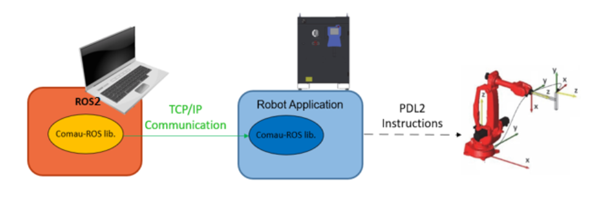
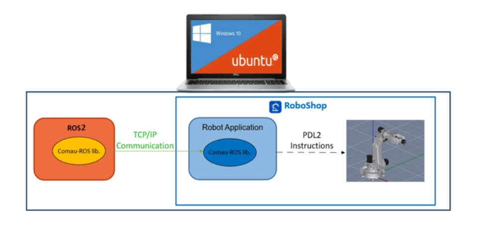
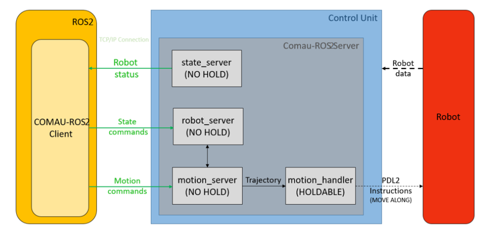

## Overview
This repository contains all the required ROS2 packages to work with Comau robots through ROS2.

The Comau Experimental package has been tested under ROS2 Humble and Ubuntu 22.04. This is research code, expect that it changes often and any fitness for a particular purpose is disclaimed.

## Acknowledgment
Developed in collaboration between:

  &nbsp; and &nbsp;

## Short scheme

The library is based on TCP/IP communication between the ROS2 module running on an external PC and the PDL module running on the cabinet IPC. The following figure reports the set-up.

[]

It is also possible to use the library in virtual mode. In this case, the user only needs a laptop where both Windows and Linux run. The former is necessary to support RoboShop Comau software tool; the latter is used for ROS2.

[]
## How to Start the Communication on Robot Side

This repository contains the PDL code used for the COMAU ROS2 interface.

Translate all four PDL files into cod files and upload them on the C5GPlus controller using the FTP within the folder "UD:\USR\comau_ros2_server".

 - pdl_tcp_functions - NO HOLD PDL program with utility functions for the TCP/IP communication
 - state_server - NO HOLD PDL program that contains a TCP server for publishing robot's state
 - robot_server - NO HOLD PDL program that contains a TCP server for receiving driver management commands
 - motion_server - NO HOLD PDL program that contains a TCP server for receiving motion commands
 - arm1_handler - HOLD PDL program that executes the motion commands

Load and activate only the pdl_tcp_functions.cod file which will automatically load and activate the other files. It is necessary to set the robot in Drive-On state and press the green Start button before launching the client.
The Robot Controller should have the following software options:
TCP/IP

[]

## How to use the COMAU ROS2 Client

## Real Robot/Roboshop

To undesrtand the driver follow the instructions at 

[comau_ros2_client README](comau_ros2_client/README.md)
