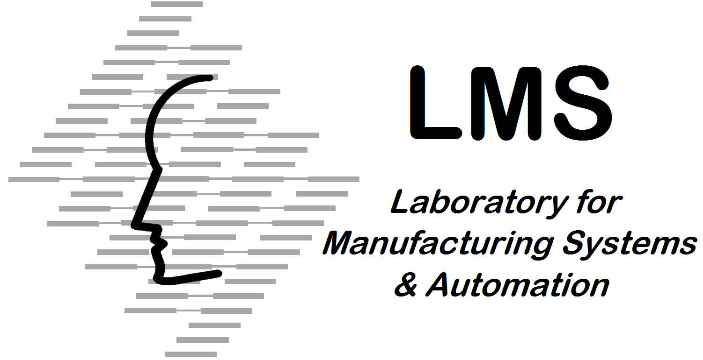

# Comau ROS2 Client

## Overview

This repository contains all the required ROS2 packages to work with Comau robots through ROS2.

The Comau Experimental package has been tested under ROS2 Humble and Ubuntu 22.04. This is research code, expect that it changes often and any fitness for a particular purpose is disclaimed.


## Acknowledgment

Developed in collaboration between:

[](http://lms.mech.upatras.gr) &nbsp; and &nbsp;
[](https://www.comau.com/en)


## Installation

### Building from Source

#### Requirements

- [Robot Operating System (ROS2)](https://docs.ros.org/en/humble/index.html) (middleware for robotics)

It is recommended to use **Ubuntu 22.04 with ROS Humble**.

#### Building procedure

```bash
# source global ros
source /opt/ros/<your_ros_version>/setup.bash

# create a ros2 workspace
mkdir -p ros2_humble/src && cd ros2_humble/src


# Clone the latest version of this repository into your ros2 workspace *src* folder.
git clone <repository link>


# build the workspace
colcon build


# activate the workspace
source install/setup.bash


```

## How to use the COMAU ROS2 driver

## Real Robot/Roboshop

To start the driver follow the instructions at 

[comau_bringup README](comau_bringup/README.md)


### After that you are ready to start interfacing with the robot through ros 
1. How to use Asynchronous Joint/Cartesian feature
    
    [comau_handlers README](comau_driver/comau_handlers/README.md)

2. **For examples on how to use the c++ see the comau_example package**

    [comau_example README](comau_example/README.md)

## URDF Robot Visualization without communication

[comau_viz README](comau_viz/README.md)
