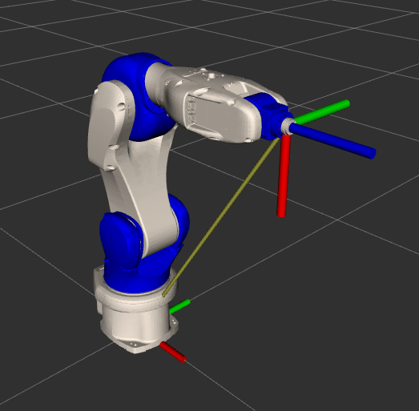

# comau_bringup

## Prerequisites

Server side:
Load and activate only the pdl_tcp_functions.cod file which will automatically load and activate the other files. It is necessary to set the robot in Drive-On state and press the green Start button before launching the client.

**Furthermore**

You need to setup the parameters in the comau_bringup/config/general_consig.yaml (robot_ip etc).

**ATTENTION!!!**\

Always check the robot surroundings. Make sure that no one is near the robot.

## To start the connection

```bash
ros2 launch comau_bringup start_comau_client.launch.py robot_type:=<robot_model>
```
For the parameter robot_model use one of the robot model contained into comau-ros2-library\comau_ros2_client\comau_description folder or ones suggested by terminal, e.g.

```bash
Client closed. Please choose a robot_type:= 
 aura 
 aura-mimic 
 nj4-110 
 nj4-170-29 
 nj130-26 
 nj220 
 racer5-0-80 
 racer5-cobot 
 racer5-cobot-rail 
 racer7-14
```

## To establish the connection

Finally, you should call the service /tcpip_conn_manager to start the TCP/IP communication as follow:

```bash
ros2 service call /tcpip_conn_manager comau_msgs/srv/OpenConnection open_connection:\ true\
```
[]

## How to monitor and change the state of the robot

The status of the robot is published on the topic /robot_status. You can monitor is by echo the mentioned topic:

```bash
 ros2 topic echo /robot_status
```
The robot can be in one of the following states:

```bash
terminate # pdl programs are terminated
canceling # canceling the motions
ready     # ready to receive commands 
resuming  # resuming from reset
moving    # moving
succeeded # trajectory succeeded
paused    # robot is locked / paused
error     # robot is in error state
```
You can change the state of the robot by calling the service /set_arm_state in the following way:

```bash
# This service call will Terminate the driver
# All pdl files are deactivated
ros2 service call /set_arm_state comau_msgs/srv/SetArmState arm_state:\ 0\  


# This service call will Lock the robot
# without canceling the trajectory
# Placing the robot in a paused state (the asynchronous action servers will not succeed # until the arm is unlocked, or reset and might timeout)
ros2 service call /set_arm_state comau_msgs/srv/SetArmState arm_state:\ 1\


# This service call will Reset the robot
# Canceling all trajectories and setting the robot into a Ready state
# * The robot also reset's when the controller's are switched
ros2 service call /set_arm_state comau_msgs/srv/SetArmState arm_state:\ 2\


# This service call will Unlock the robot, 
# the trajectory will continue, placing the robot in a Moving state
# If the trajectory succeds the robot will go to a ready state, 
# otherwise it will remain in a Moving state and will need a reset call to return to a # Ready state, so it can receive the next trajectory
ros2 service call /set_arm_state comau_msgs/srv/SetArmState arm_state:\ 3\

```
## How to monitor $DIN and $DOUT pins and change them:

1 - Put on din_pins the $DIN pins you want to listen to (-1 -> bypass this pin) the size must be 6.
2 - Put on dout_pins the $DOUT pins you want to listen to (-1 -> bypass this pin) the size must be 6.
3 - The $DIN and $DOUT state will get publish on the topic /io_states

```bash
ros2 topic echo /io_states
```
4 - In order to change the state of a $DOUT pin you can use the following service call.

```bash
ros2 service call /set_io comau_msgs/srv/SetIO pin:\ 81\ state:\ false\ 
```

## How to monitor server error value:

The error value of the robot is published on the topic /server_error. You can monitor is by echo the mentioned topic:

```bash
ros2 topic echo /server_error
```

The robot error can be in one of the following:

```bash
ERR_TCP_UNDEFINED      0x00001 # Undefined      error
ERR_TCP_CONN_STATE     0x00002 # State  Server  error 15470 : Address already in use
ERR_TCP_CONN_ROBOT     0x00004 # Robot  Server  error 15470 : Address already in use
ERR_TCP_CONN_ARM       0x00008 # Motion Handler error 15470 : Address already in use
ERR_TCP_READ           0x00010 # State  Server  error 40033 : Error 15474 in write  
ERR_TCP_WRITE_CMD      0x00020 # Robot  Server  error 39990                         
ERR_TCP_WRITE_MOTION   0x00040 # Motion Handler error 39990                         
ERR_TCP_DISCONN_STATE  0x00080 # State  Server  error 30767                         
ERR_TCP_DISCONN_ROBOT  0x00100 # Robot  Server  error 30767                         
ERR_TCP_DISCONN_ARM    0x00200 # Motion Handler error 30767  
ERR_SAFETY_GATE        0x00400 # Safety Gate / External Emergency Stop              
ERR_WRONG_MOTION       0x00800 # Program Execution Errors (36864-37191)
```

## How to monitor the joint state from the robot controller

The joint state of the robot is published on the topic /joint_states. You can monitor is by echo the mentioned topic:

```bash
ros2 topic echo /joint_states
```
