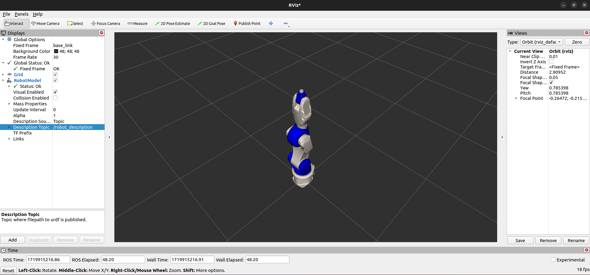

# comau_viz

## Prerequisites

Rviz2 installed.

## To run the visualization

If you want to see just the robot without any connections with the real one, you can run the comau_viz package with the launcher of the chosen robot.

## e.g.
```bash
ros2 launch comau_viz view_racer5-cobot.launch.py
```
[]
